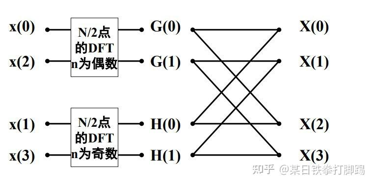
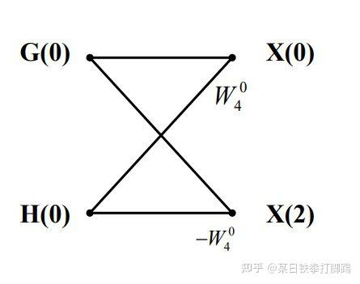
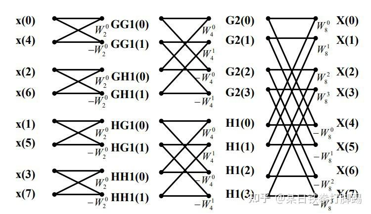
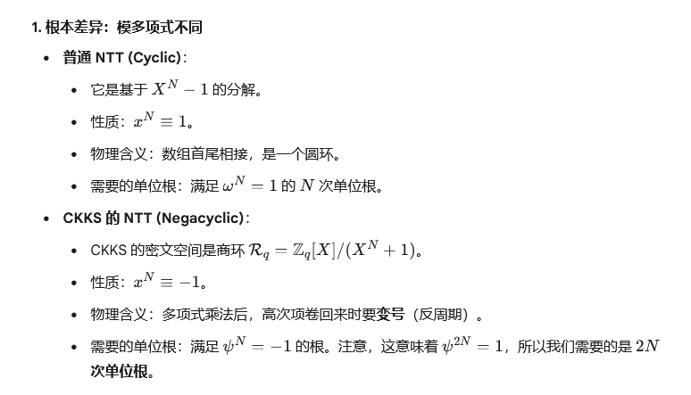

# FFT 基本原理
DFT是傅里叶变换在时域和频域上都呈离散的形式

对于某一序列$\{x_{n}\}_{n=0}^{N-1}$，其满足有限性条件，它的DFT如下：
$$
X_{k}=\sum\limits_{n=0}^{N-1}x_{n}e^{-i\frac{2\pi}{N}kn}
$$

我们通常用符号$\mathcal{F}$来表示这个变换，即$\hat{x}=\mathcal{F}x$

其逆离散傅里叶变换（IDFT）如下：
$$
x_{n}=\frac{1}{N}\sum\limits_{k=0}^{N-1}X_{k}e^{i\frac{2\pi}{N}kn}
$$

可以计为$x=\mathcal{F}^{-1}\hat{x}$


由于$e^{-i\frac{2\pi}{N}kn}$可以看做是单位根$e^{-i\frac{2\pi}{N}k}$的$n$次方，这是一个十分特殊的形式，因此我们可以将$x_{n}$看作是多项式$a_{0}+a_{1}y+\dots+a_{n}y^{n}$中的系数$a_{n}$，那么$X_{k}$可以看作是多项式在单位根上的求值（值评估）

同时注意到，这种求和本质上是一个线性运算，因此可以变为矩阵的表示
$$
\begin{bmatrix}
X_0 \\
X_1 \\
X_2 \\
\vdots \\
X_{N-1}
\end{bmatrix}
=
\begin{bmatrix}
1 & 1 & 1 & \cdots & 1 \\
1 & \alpha & \alpha^2 & \cdots & \alpha^{N-1} \\
1 & \alpha^2 & \alpha^4 & \cdots & \alpha^{2(N-1)} \\
\vdots & \vdots & \vdots & \ddots & \vdots \\
1 & \alpha^{N-1} & \alpha^{2(N-1)} & \cdots & \alpha^{(N-1)(N-1)}
\end{bmatrix}
\begin{bmatrix}
x_0 \\
x_1 \\
x_2 \\
\vdots \\
x_{N-1}
\end{bmatrix}
$$
其中$\alpha=e^{-i\frac{2\pi}{N}}$

## 分治FFT
举例来说，对于一个7次（N=8）多项式
$$
f(x)=a_{0}+a_{1}x+a_{2}x^{2}+a_{3}x^{3}+a_{4}x^{4}+a_{5}x^{5}+a_{6}x^{6}+a_{7}x^{7}
$$

我们可以按照奇偶来划分，然后对奇数系数序号的四项提出$x$这个公因子
$$
\begin{aligned}
f(x) &= (a_0 + a_2x^2 + a_4x^4 + a_6x^6) + (a_1x + a_3x^3 + a_5x^5 + a_7x^7) \\
&= (a_0 + a_2x^2 + a_4x^4 + a_6x^6) + x(a_1 + a_3x^2 + a_5x^4 + a_7x^6)
\end{aligned}
$$

> [!question] N是什么？
> N在这里表示的是多项式的系数数量，对于7次多项式，其系数数量就是8

我们可以用奇偶次项建立新的函数：
$$
\begin{aligned}
G(x) &= a_0 + a_2x + a_4x^2 + a_6x^3 \\
H(x) &= a_1 + a_3x + a_5x^2 + a_7x^3
\end{aligned}
$$

那么原先的$f(x)$可以用新的函数表示：
$$
f(x) = G(x^2) + x \times H(x^2)
$$

由于我们的单位根有如下性质：
$$
\begin{align}
\omega_{N}^{k}=e^{-i\frac{2\pi}{N}k}
\end{align}
$$
$$
\begin{align}
\omega_{N}^{k+N/2} &= e^{-i\frac{2\pi}{N}k}e^{-i\frac{2\pi}{N}\frac{N}{2}} \\ 
&=-e^{-i\frac{2\pi}{N}k} \\
&=-\omega_{N}^{k}
\end{align}
$$

且$G(x^{2})$与$H(x^{2})$是偶函数，因此我们可以知道$w_{N}^{k}$和$\omega_{N}^{k+N/2}$在$G(x^{2})$上的评估值是相同的，在$H(x^{2})$中也遵循同样的规律

因此我们有
$$
\begin{aligned}
f(\omega_N^k) &= G((\omega_N^k)^2) + \omega_N^k \times H((\omega_N^k)^2) \\
&= G(\omega_N^{2k}) + \omega_N^k \times H(\omega_N^{2k}) \\
&= G(\omega_{N/2}^k) + \omega_N^k \times H(\omega_{N/2}^k)
\end{aligned}
$$

以及
$$
\begin{aligned}
f(\omega_N^{k+N/2}) &= G(\omega_N^{2k+N}) + \omega_N^{k+N/2} \times H(\omega_N^{2k+N}) \\
&= G(\omega_N^{2k}) - \omega_N^k \times H(\omega_N^{2k}) \\
&= G(\omega_{N/2}^k) - \omega_N^k \times H(\omega_{N/2}^k)
\end{aligned}
$$

这样子，我们在求出$G(\omega_{N/2}^{k})$以及$H(\omega_{N/2}^{k})$后，就可以同时求出$f(\omega_N^k)$以及$f(\omega_N^{k+N/2})$，然后对$G$和$H$分别递归进行DFT即可

[快速傅里叶变换(蝶形变换)-FFT](https://zhuanlan.zhihu.com/p/374489378)
由于$\omega_N^k$与$\omega_N^{k+N/2}$正好隔着一个半周期，因此如果我们将这个递归过程画出来，我们会发现，这个过程很像蝴蝶，这正是蝶形变换的来源。
以下是N=4的例子


下图则被称为一个蝶形运算单元


以下是N=8的例子


## 蝶形变换FFT
[快速傅里叶变换(蝶形变换)-FFT](https://zhuanlan.zhihu.com/p/374489378)

除了使用递归的方法，我们也可以使用递推的方法。

### 多项式的层级划分 ($N=8$) 
我们将分解过程分为 4 个层级（Layer）： 
1. **初始层**：待划分的完整多项式 $$f\{a_0, a_1, a_2, a_3, a_4, a_5, a_6, a_7\}$$
2. **第一轮奇偶划分**： $$G\{a_0, a_2, a_4, a_6\}, \quad H\{a_1, a_3, a_5, a_7\}$$
3. **第二轮奇偶划分**： $$GG\{a_0, a_4\}, \quad GH\{a_2, a_6\}, \quad HG\{a_1, a_5\}, \quad HH\{a_3, a_7\}$$
4. **最细粒度（叶子节点）**： $$\{a_0\},\{a_4\},\{a_2\},\{a_6\},\{a_1\},\{a_5\},\{a_3\},\{a_7\}$$

**层级解析：** 
* **第 2 层**：根据经典的奇偶划分，$G$ 包含偶数索引系数，$H$ 包含奇数索引系数。 
* **第 3 层**：对 $G$ 和 $H$ 继续进行奇偶划分。例如 $G(x)$ 被划分为 $GG(x^2)$ 和 $x \cdot GH(x^2)$。 
	* *示例*：$GG$ 对应的多项式为 $a_0 + a_4 x$，此时它还是关于 $x$ 的函数。
* **第 4 层**：划分至不再包含 $x$ 的常数项。 
	* *示例*：$GG(x)$ 向下分解为常数 $a_0$ 和 $a_4$。此时 $a_i$ 已被视为独立的频域分量（点值）。

### 自底向上的合并（递推） 
迭代法的核心是**逆向还原**上述过程。
我们需要将第 4 层的常数项两两合并，最终还原为第 1 层的结果。

> [!warning] 关键点：单位根的变化 
> 在合并过程中，随着多项式阶数 $N$ 的每一层变化，对应的单位根 $\omega_{N}^{k}$ 也在变化。
> * **底层合并**：处理 $N=2$ 的规模，使用 $\omega_{2}^{0}$。 
> * **顶层合并**：处理 $N=8$ 的规模，使用 $\omega_{8}^{k}$。

### 数据重排：位逆序置换 (Bit-Reversal Permutation) 
观察第 4 层的系数排列： $$\{a_0, a_4, a_2, a_6, a_1, a_5, a_3, a_7\}$$**核心发现**： 由于每一层递归都是基于“奇偶”而非简单的“左右”切分，导致最终叶子节点的顺序并不是线性的 $0 \to 7$。为了使用迭代法（自底向上合并），我们需要先将原始数组重排成上述顺序。 

> [!question] 如何高效地重排系数？ 
> 我们可以使用**位逆序置换（Bit-Reversal Permutation）**算法。 
> **原理**：对于 $N=2^n$，将下标的二进制表示进行翻转，即可得到其在叶子节点中的最终位置。 
> * **例 1**：原下标 $2$ (二进制 `010`) $\rightarrow$ 翻转后 `010` $\rightarrow$ 新位置 $2$。 
> * **例 2**：原下标 $4$ (二进制 `100`) $\rightarrow$ 翻转后 `001` $\rightarrow$ 新位置 $1$。 
> 
> *注意：观察上面的序列，原下标 4 的 $a_4$ 确实出现在了数组索引 1 的位置（即第 2 个位置）。*

> [!note] 规律与证明线索 
> 观察系数的分布规律： 
> * $a_0$ 与 $a_1$ 在第 1 次划分时分开，最终它们的物理距离差为 4 ($N/2$)。 
> * $a_0$ 与 $a_2$ 在第 2 次划分时分开，最终它们的物理距离差为 2 ($N/4$)。 
> * 以此类推，第 $k$ 次划分分开的元素，最终距离为 $N/2^k$。 
> 
> 利用这个序号差与 $a_0$ 的绝对位置，我们可以确定所有参数的最终位置

### 蝶形变换的优势
经过变换后，我们可以将第一层的运算结果存储在一个数组中，然后逐渐两两合并，最终得到计算结果，达到节约空间复杂度的目的（递归方法空间比这个方法多得多）

# NTT 基本原理
在数学中，NTT 是关于任意 [环](https://oi-wiki.org/math/algebra/basic/#%E7%8E%AF) 上的离散傅立叶变换（DFT）。在有限域的情况下，通常称为数论变换（NTT）。

**数论变换**（number-theoretic transform, NTT）是离散傅里叶变换（DFT）在数论基础上的实现；**快速数论变换**（fast number-theoretic transform, FNTT）是 [快速傅里叶变换](https://oi-wiki.org/math/poly/fft/)（FFT）在数论基础上的实现。

在 FFT 中，有两个单位根的性质是非常重要的：
- 周期性：$\omega_{N}^{N}=1$
- 消去律：$\omega_{N}^{N/2}=-1$

而在 $\mathbb{Z}_{p}$ 的世界中，我们需要的原根则是
$$
\begin{align}
&g_{N}=g^{q} \pmod p, \\
&p=qN+1, \\
&N=2^{m}
\end{align}
$$

注意，$p$ 是一个质数，$N$ 在这里仍然表示多项式系数的数量，也间接着表示多项式的最高次数。

由于 $p-1=qN$，根据费马小定理，对于质数 $p$，我们有 $g^{p-1}\equiv 1 \pmod p$，因此
$$
g^{qN}\equiv 1 \pmod p
$$

也就是
$$
\begin{align}
g_{N}^{N}\equiv 1 \pmod p
\end{align}
$$

而由于 $(g_{N}^{N/2})^{2}=g_{N}^{N}\equiv 1 \pmod p$，在模数的世界中，平方为 $1$ 的数只有 $1$ 或者 $-1$（即 $p-1$），而由于原根的限制是 $N$ 为满足 $g_{N}^{N}\equiv 1 \pmod p$ 的最小数，因此 $g_{N}^{N/2}$ 只能等于 $-1$。

所以，$g_{N}$ 具有如下的特性
$$
\begin{align}
g_{N}^{N}\equiv 1 \pmod p \\
g_{N}^{N/2}\equiv -1 \pmod p
\end{align}
$$

这些特性决定了我们能够使用类似 FFT 的方法加速运算。

对于质数 $p$，我们能找到足够的满足要求的 $p$ 进行计算，常见的 $p$ 如下：


有些时候，$N$ 是非常大的，然而我们不需要那么多的多项式参数，因此我们可以令单位根为
$$
g_{n}=g^{\frac{qN}{n}}
$$

然后我们有
$$
\begin{align}
g_{n}^{n}=g^{(qN/n)\cdot n}\equiv 1 \pmod p \\
g_{n}^{n/2}=g^{(qN/n)\cdot (n/2)}=g^{qN/2}\equiv -1 \pmod p
\end{align}
$$

使用变换后的单位根，相当于缩减了 $N$ 的大小。

如果换一种更常见的写法，因为有限域 $\mathbb{Z}_{p}^{*}$ 的乘法群阶为 $p-1$，所以只要
$$
n \mid (p-1)
$$

就可以从一个 primitive root $g$ 构造出
$$
\omega = g^{(p-1)/n}
$$

如果把 $p-1$ 写成
$$
p-1 = kN
$$

并且想从一个更大的 $2$ 的幂次子群里取出长度为 $n$ 的子变换，那么就可以写成
$$
g_n = g^{kN/n}
$$

这和前面写的
$$
g_n = g^{qN/n}
$$

本质上是同一个意思，只是这里把前面式子中的陪因子单独记成了 $k$，避免和代码里把 $q$ 当作模数的写法混淆。也就是说，这里只是**记号微调**，不是在推翻你前面的推导。

对于质数 $p$，常见的 NTT-friendly prime 一般都满足
$$
p \equiv 1 \pmod n
$$

而在 RLWE 场景里更常见的是
$$
p \equiv 1 \pmod {2n}
$$

## 标准 NTT 的卷积语义

标准 NTT 对应的是循环卷积，也就是多项式环
$$
Z_p[x] / (x^n - 1)
$$

在这个环里，$x^n \equiv 1$，所以高次项会“无符号地折回去”。如果你只是想在普通多项式环里做乘法，那么两个次数小于 $n$ 的多项式相乘后最高次数可以到 $2n - 2$，这时如果仍然只用长度 $n$ 的 NTT，就会发生卷积混叠。

这也是教材里总说“NTT 乘法要补零”的原因：

1. 把两个多项式补零到足够长度
2. 做标准 NTT
3. 频域逐点乘
4. 做 INTT

相关示意图仍然可以参考：

- `attachments/cyclic-convolution-aliasing.png`
- `attachments/zero-padding-ntt-convolution.png`

## CKKS 中的特殊 NTT：Negacyclic NTT

CKKS / RLWE 真正工作的环不是
$$
Z_p[x] / (x^n - 1)
$$

而是
$$
Z_p[x] / (x^n + 1)
$$

也就是
$$
x^n \equiv -1
$$

所以高次项回卷时会带一个负号，这种卷积叫 negacyclic convolution。

这时最自然的做法不是直接只谈 $n$ 阶根，而是先找一个 primitive $2n$ 阶单位根 $\psi$：
$$
\psi^{2n} \equiv 1 \pmod p,\qquad \psi^n \equiv -1 \pmod p
$$

它要求
$$
p \equiv 1 \pmod {2n}
$$

再定义
$$
\omega = \psi^2
$$

则 $\omega$ 就是一个 primitive $n$ 阶单位根。这里可以这样理解：

- $\psi$ 负责把 $x^n = -1$ 这个负号结构编码进去
- $\omega$ 负责标准长度 $n$ 的蝶形递归

所以文档里同时出现 $n$ 和 $2n$ 并不矛盾，它们谈的是两个不同但相关的根。

> [!note]
> $g_n = g^{kN/n}$ 这种写法是在谈“怎么从更大的子群里抽出一个 $n$ 阶根”。
> $\psi = g^{(p-1)/(2n)}$ 这种写法是在谈“负循环 NTT 里先找一个 $2n$ 阶根”。
> 两者都对，只是语境不同。

# NTT 实现细节

## Cooley-Tukey 蝴蝶操作

无论是 FFT、标准 NTT，还是 negacyclic NTT，最核心的计算单元都是蝶形。对于一对输入 $u, v$ 和一个 twiddle $w$，前向蝶形可以写成

$$
\begin{aligned}
t &= v \cdot w \pmod p \\
y_0 &= u + t \pmod p \\
y_1 &= u - t \pmod p
\end{aligned}
$$

实现里通常对应：

```text
t  = mul_mod(v, w, p)
a' = add_mod(u, t, p)
b' = sub_mod(u, t, p)
```

逆变换时使用逆 twiddle $w^{-1}$，并在最后整体乘上 $n^{-1}$。不少实现会把这个归一化因子融合到最后一层或者 inverse 的最后一步里。

如果用迭代版 Cooley-Tukey，最常见的外层结构大致是：

```text
len = 1
while len < n:
    step = n / (2 * len)
    for block in 0..n step 2*len:
        for j in 0..len:
            w = twiddle[j * step]
            u = a[block + j]
            v = a[block + j + len]
            t = v * w mod p
            a[block + j]       = u + t mod p
            a[block + j + len] = u - t mod p
    len *= 2
```

## 旋转因子预计算

twiddle factor 就是蝶形里反复使用的单位根幂次。预计算的目的很直接：把热路径里的 `mod_pow` 全都挪到 plan 初始化阶段。

最基础的预计算包括：

1. $\omega^0, \omega^1, \ldots, \omega^{n-1}$
2. inverse 用到的 $\omega^{-0}, \omega^{-1}, \ldots, \omega^{-(n-1)}$
3. 如果走的是 negacyclic 的 “twist + 标准 NTT” 路线，还要预计算 $\psi^j$ 与 $\psi^{-j}$

twiddle 的存储顺序也会影响接口语义。有的实现把输入先做 bit-reversal，输出保持自然顺序；有的实现保持输入自然顺序，但让频域结果落在 bit-reversed 顺序。

本项目现在把两条路线明确拆开了：

- 主实现 `fhe-math::ntt::NttPlan` 走“twist + cyclic NTT”，并计划采用 `forward = DIF`、`inverse = DIT`
- 参考实现 `fhe-math::ntt::reference::ConcreteNttRefPlan` 保留 `concrete-ntt`

这样做的直接好处是：

- `forward_to_bitrev` 输出可以保留 bit-reversed 顺序
- `inverse_from_bitrev` 直接消费 bit-reversed 顺序
- 中间的点乘路径不必额外做一次位翻转
- 如果某个调用点确实想看自然顺序频域，再显式调用 `bit_reverse_in_place`

## 负循环 NTT（Negacyclic NTT）

### Twist factor 到底在做什么

如果我们定义扭转后的系数

$$
a'_j = a_j \psi^j
$$

并记
$$
\omega = \psi^2
$$

那么对 $a'$ 做一次标准 NTT 得到

$$
\hat{a}_k
= \sum_{j=0}^{n-1} a'_j \omega^{jk}
= \sum_{j=0}^{n-1} a_j \psi^j (\psi^2)^{jk}
= \sum_{j=0}^{n-1} a_j \psi^{j(2k+1)}
$$

也就是说，我们实际上是在奇数次幂点

$$
\psi,\ \psi^3,\ \psi^5,\ \ldots,\ \psi^{2n-1}
$$

上评估多项式。这些点天然满足
$$
x^n = -1
$$

所以正好对应
$$
Z_p[x] / (x^n + 1)
$$

这个负循环环。

逆变换时再把这个扭转消掉：

$$
a_j = \psi^{-j} \cdot n^{-1} \sum_{k=0}^{n-1} \hat{a}_k \omega^{-jk}
$$

所以 twist factor 的一句话解释就是：

它把
$$
x^n + 1
$$

上的问题变形成一次“标准长度 $n$ 的 NTT”，从而复用普通蝶形结构。

### 为什么 CKKS 的 negacyclic NTT 不需要补零

这里“不需要补零”并不是说乘法结果没变长，而是因为我们本来就不是在普通多项式环里做乘法，而是在商环

$$
Z_p[x] / (x^n + 1)
$$

里做乘法。

在这个环中，所有高于 $n-1$ 次的项都会立即根据

$$
x^n \equiv -1
$$

折叠回前 $n$ 项，因此结果本来就只需要 $n$ 个系数表示。负循环 NTT 直接对这个商环做对角化，所以不需要像普通卷积那样先补零再避免混叠。

### 本项目里的语义

这部分需要特别说清楚，因为它直接影响代码该不该手动乘 twist factor。

本项目主实现的数学目标仍然是“教材式”的 negacyclic NTT，也就是：

1. 求
   $$
   \psi = g^{(p - 1)/(2n)}
   $$
2. 令
   $$
   \omega = \psi^2
   $$
3. forward 前先乘 $\psi^j$
4. 跑一次标准长度 $n$ 的 NTT
5. inverse 后再乘 $\psi^{-j}$

但在工程实现上，当前框架会进一步细分成：

- forward：twist + cyclic DIF
- inverse：cyclic DIT + normalize + untwist
- bit-reversal：单独函数，只有在调用方真的需要自然顺序频域时才显式执行

同时，`concrete_ntt::prime64::Plan` 被单独放在 ref 路径里，用来做一致性校验。也就是说：

- `NttPlan::new` / `forward_to_bitrev` / `inverse_from_bitrev` 代表的是自研主实现框架
- `reference::ConcreteNttRefPlan` 代表第三方对照实现
- 业务代码可以显式决定何时做 bit-reversal
- 测试里可以用 ref 去校验自研实现结果是否一致

## 代码对应

- `crates/fhe-math/src/ntt.rs`
  - `NttPlan::new`
  - `NttPlan::forward`
  - `NttPlan::inverse`
  - `primitive_root_of_unity`
- `crates/fhe-math/src/poly.rs`
  - `Poly::mul`
  - `Poly::ntt_forward`
  - `Poly::ntt_inverse`

## 参考资料

- `concrete-ntt` docs.rs: <https://docs.rs/concrete-ntt/latest/concrete_ntt/>
- `concrete-ntt::prime64` docs.rs: <https://docs.rs/concrete-ntt/latest/concrete_ntt/prime64/>
- Longa, Naehrig, "Speeding up the Number Theoretic Transform for Faster Ideal Lattice-Based Cryptography": <https://eprint.iacr.org/2016/504>
- Zhou et al., "Preprocess-then-NTT Technique and Its Applications to KYBER and NEWHOPE": <https://eprint.iacr.org/2018/995>

## TODO

- [x] 搭建 `forward = DIF` / `inverse = DIT` 的自研框架
- [x] 抽出独立的 bit-reversal 工具函数
- [x] 保留第三方 `ref` 实现用于对照
- [ ] 补完 `forward_core_dif`
- [ ] 补完 `inverse_core_dit`
- [ ] 用 ref 校验自研实现结果
