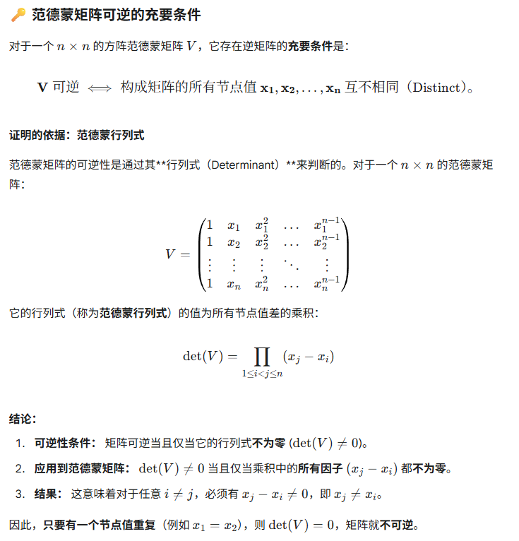
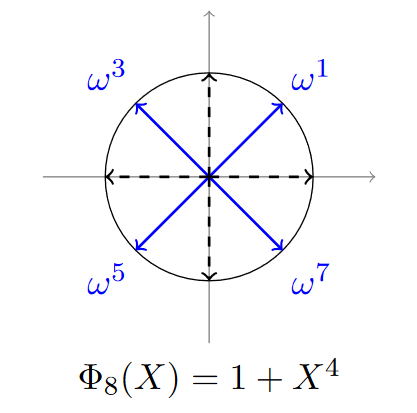
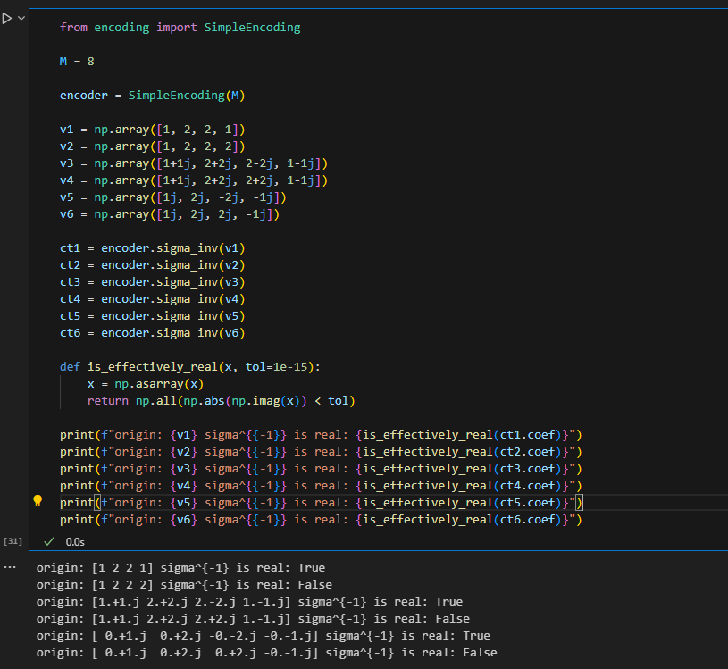

# CKKS 编码：规范嵌入

## 核心思想

CKKS 将 n/2 个复数打包进一个次数为 n 的多项式，通过规范嵌入（Canonical Embedding）实现。

## Encoding & Decoding概述
[CKKS explained, Part 2: Full Encoding and Decoding – OpenMined](https://openmined.org/blog/ckks-explained-part-2-ckks-encoding-and-decoding/)

Encoding主要做的事情就是把message从vector的形式变为plaintext的形式，也就是
$$
C^{\frac{N}{2}}=>Z[X]/(X^{N}+1)
$$
其中，$X^{N}+1$是一个（2N次的）分圆多项式，也是一个不可约多项式

> [!summary] 
> ***最终的编码过程如下：***
>- $z \in C^{N/2}$
>- $\pi^{-1}(z) \in \mathbb{H}$
>- $\Delta \pi^{-1}(z)$
>- 投射到$\sigma(R)$中：$\lfloor \Delta \cdot \pi(z) \rceil_{\sigma(R)} \in \sigma(R)$
>- 用$\sigma$进行编码：$m(X)=\sigma^{-1}(\lfloor \Delta \cdot \pi(z) \rceil_{\sigma(R)}) \in R$
>
>***最终的解码过程如下：***
>$z=\pi \circ \sigma(\Delta^{-1}\cdot m)$

## 数学知识
### canonical embedding 典范嵌入
典范嵌入是一类泛指的嵌入，指的是 ***原环元素在扩张结构中的”自然对应“***
简单的典范嵌入有$Z->Q$
我们处理的典范嵌入则是如下图所示：
$$
\sigma:C[X]/(X^{N}+1)=>C^{N}
$$
典范嵌入将分圆多项式$\Phi_{M}(X)=X^{N}+1$的各个根$\xi,\xi^{3},...,\xi^{2N-1}$带入目标多项式$C[X]/(X^{N}+1)$中逐个evaluate，然后得到的根组合成$C^{N}$
也即：
$$
\begin{aligned}
\sigma(m)&=(m(\xi),m(\xi^{3}),...,m(\xi^{2N-1}))\\
&= (z_{1},...,z_{N})
\end{aligned}
$$
注意，这里的根是从1到2N-1而不是N的

典范嵌入σ定义了一个同构（也就是说它定义了一个双射同态），在计算上它是同态的，在映射上是双射的

#### 分圆多项式的根
$$
\phi_{n}(x)=\prod\limits_{1\le k\le n,gcd(k,n)=1}(x-e^{2i\pi \frac{k}{n}})
$$

当$N=2^{k}$时，有
$$
\phi_{2N}(X)=X^{N}+1
$$
#### 双射的说明
已知：
$$m(X)=\sum\limits_{i=0}^{N-1}=\alpha_{i}X^{i} \in C[X]/(X^{N}+1)$$
评估是如下进行的：
$$\sum\limits_{j=0}^{N-1}\alpha(\xi^{2i-1})^{j}=z_{i},i=1,...,N$$

因此我们可以将其看作一个矩阵乘法：
$$A\alpha=z$$

由于A是一个范德蒙矩阵，且构成$x$的根各不相同，因此存在逆矩阵

### $Z[X]/(X^N+1)$上的典范嵌入

由上图的N=4的简单情况可知，分圆多项式的根实际上是对称的。
在这个例子中，有$\omega_{1}=\overline{\omega_{7}}$，$\omega_{3}=\overline{\omega_{5}}$
考虑到总数=8，我们就有了$\omega_{j}=\overline{\omega_{-j}}$

由于在$m(x) \in Z[X]$中做评估，因此就有了$m(\xi^{j})=\overline{m(\xi^{-j})}=m(\overline{\xi^{-j}})$

由于$\sigma$映射中的每一个向量元素都是由多项式在单位根上评估而来，因此我们有：
$$
\begin{align}
Z_{N}&= (z_{1},...,z_{N})\\
     &= (m(\xi),m(\xi^{3}),...,m(\xi^{2N-1})) \\
     &= (m(\xi),m(\xi^{3}),...,m(\overline{\xi^{3}}),m(\overline{\xi})) \\
     &= (z_{1},z_{2},...,\overline{z_{2}},\overline{z_{1}})
\end{align}
$$

因此，需要在实数参数的$m(x)$的情况下，评估出来的$Z_{N}$实际上自由度只有$N/2$

从典范嵌入的正方向的例子可以说明（但是不是证明），如果我们想要保证典范嵌入的逆方向$\sigma^{-1}:C^{N} \to Z[X]/(X^N+1)$，复向量映射到$Z[X]/(X^N+1)$，我们至少要保证$C^{N}$的自由度减半，也就是变为$C^{N/2}$

从以下的代码以及输出也可以看出相关的结论：我们会发现，当M=8，N=4是，如果输入vector是形如上文的$Z_{N}$的形式，那么转换出来的多项式是实数的，如果输入的vector不是这样，那么转换的多项式$m(x)\notin Z[X]$

### $\pi$操作
$$
\begin{align}
&\pi: \mathbb{H}\to C^{\phi(M)/2} \\
&where~\mathbb{H}=\{(z_{j})_{j \in\mathbb{Z^{*}_{M}}}:z_{j}=\overline{z_{-j}},\forall j \in Z^{*}_{M}\} \in \mathbb{C}^{\phi(M)}
\end{align}
$$

其中$z_{j}$与$z_{-j}$可以参考上文的$\omega$，只不过这里指的是向量的元素
$Z^{*}_{M}$表示的是模$M$乘法群，包含了所有与$M$互素的元素

$\phi(M)$表示$M$的欧拉函数，也就是说，表示所有与$M$互素的函数个数，在$M$是2的幂次的情况下，$\phi(M)=\frac{M}{2}$

因此$\pi$操作实际上表示的是将原先的$C^{N}$映射到$C^{N/2}$中，其更加详细的数学表述如下：
$$
\begin{align}
&\pi(Z) = (z_j)_{j \in S}, \\
&where~S = \{ j \in \mathbb{Z}_M^* \mid 1 \le j < M/2 \}
\end{align}
$$

#### 示例： $M=8$ (对应 $\Phi_8(X)$)

用$M=8, N=\phi(M)=4$来演示这个流程：

1. **索引集：** $\mathbb{Z}_8^* = \{1, 3, 5, 7\}$。
2. **划分：**
    - $j=1 \implies -j=7 \pmod 8$。 配对：$\{1, 7\}$。
    - $j=3 \implies -j=5 \pmod 8$。 配对：$\{3, 5\}$。
3. **代表集：** 我们按规范选择 $S = \{ j \in \mathbb{Z}_8^* \mid 1 \le j < 8/2=4 \} = \{1, 3\}$。
    - $S$ 的大小为 $|S|=2$，这等于 $\phi(8)/2 = 4/2 = 2$。
4. **$\pi$ 操作：**
    - $\mathbb{H}$ 中的一个向量是 $Z = (z_1, z_3, z_5, z_7)$。
    - 它满足 $z_5 = \overline{z_{-5}} = \overline{z_3}$ 且 $z_7 = \overline{z_{-7}} = \overline{z_1}$。
    - 因此， $Z = (z_1, z_3, \overline{z_3}, \overline{z_1})$。
    - $\pi$ 操作提取由 $S=\{1, 3\}$ 索引的分量。

$$\pi(Z) = \pi( (z_1, z_3, z_5, z_7) ) = (z_1, z_3)$$

这个 $(z_1, z_3)$ 向量就在 $\mathbb{C}^{\phi(8)/2} = \mathbb{C}^2$ 空间中。

### $\pi^{-1}$
也就是$\pi$的逆操作，参考上文应该已经可以很好的理解了
***$\pi^{-1}$ 的工作是：***
1. 接收一个 $\phi(M)/2$ 维的复向量 $v$。
2. 用 $v$ 的分量来**填充** $\mathbb{H}$ 向量的“前半部分”（由代表集 $S$ 索引）。
3. 使用共轭对称性 $z_j = \overline{z_{-j}}$ 来**计算并填充** $\mathbb{H}$ 向量的“后半部分”。

#### $\pi^{-1}$ 示例操作
$M=8$ (对应 $\Phi_8(X)$)
- **输入空间：** $\mathbb{C}^{\phi(M)/2} = \mathbb{C}^2$
- **输出空间：** $\mathbb{H} \subset \mathbb{C}^4$
- **索引集：** $\mathbb{Z}_8^* = \{1, 3, 5, 7\}$
- **代表集 (S)：** $S = \{1, 3\}$
- **对称规则：** $z_5 = \overline{z_{-5}} = \overline{z_3}$ ； $z_7 = \overline{z_{-7}} = \overline{z_1}$

假设我们从 $\mathbb{C}^2$ 中选取一个任意的输入向量 $v$：
$$v = (v_1, v_2) = (1 + 2i, \quad 3 - 4i)$$
我们要计算 $Z = \pi^{-1}(v)$。$Z$ 是一个 4 维向量 $Z = (z_1, z_3, z_5, z_7)$。
1. 填充前半部分 (由 S={1, 3} 索引)：
    我们将 $v$ 的分量直接赋给 $Z$ 中由 $S$ 索引的位置。
    - $z_1 = v_1 = \mathbf{1 + 2i}$
    - $z_3 = v_2 = \mathbf{3 - 4i}$
2. 计算后半部分 (由 {5, 7} 索引)：
    我们使用共轭对称规则来计算 $z_5$ 和 $z_7$。
    - 计算 $z_5$：
        $z_5 = \overline{z_3} = \overline{(3 - 4i)} = \mathbf{3 + 4i}$
    - 计算 $z_7$：
        $z_7 = \overline{z_1} = \overline{(1 + 2i)} = \mathbf{1 - 2i}$
1. 组合结果：
    我们得到了完整的 $\mathbb{H}$ 空间向量 $Z$：
    $$Z = (z_1, z_3, z_5, z_7)$$
    $$Z = (\underbrace{1 + 2i}_{z_1}, \quad \underbrace{3 - 4i}_{z_3}, \quad \underbrace{3 + 4i}_{z_5 = \overline{z_3}}, \quad \underbrace{1 - 2i}_{z_7 = \overline{z_1}})$$

### 坐标随机舍入(coordinate-wise random rounding)
$R:Z[X]/(X^N+1)$

事实上，我们并不能直接使用$\sigma: Z[X]/(X^N+1) \to \sigma(R) \in \mathbb{H}$，这是因为$\mathbb{H}$中的元素并不一定在$\sigma(R)$中。
这一点其实可以很好的理解——$\mathbb{H}$是不可数的，而$\sigma(R)$是可数的（由于$R$是可数且与$\sigma(R)$是同态的）

因此需要找到一个方法，将$\mathbb{H}$ 映射到$\sigma(R)$

我们可以引入***坐标随机舍入***：这是一个将实数$x$随机舍入至$\lfloor x\rfloor$或者$\lfloor x \rfloor +1$，其概率取决于$x$与$\lfloor x\rfloor$或者$\lfloor x \rfloor +1$的接近程度，越接近，概率越高。

#### 正交基与Hermite内积
$$
Hermitian~product: \langle a,b\rangle = \sum\limits_{i=1}^{N}x_{i}\overline{y_{i}} = b^{H}a
$$

>[!note] 
>Hermite内积也可以放在x上，两种结果都是内积且呈复共轭关系，不同领域有不同的用法

选取整数多项式($R:Z[X]/(X^N+1)$)中的一组正交基$\{1,X,...,X^{N-1}\}$

由于我们在$R$上选取了一组“正交基”，同样的，我们在$\sigma(R)$上选取出了一组正交基$\beta = (b_{1},b_{2},...,b_{N})=(\sigma(1),\sigma(X),...,\sigma(X^{N-1}))$

因此，我们的
$$
\begin{align}
z&=(z_{1},z_{2},...,z_{n}) \\
 &=\sum\limits_{i=1}^{N}z_{i}b_{i} \\
~~&with~z_{i}=\frac{\langle z,b_{i} \rangle}{\| b_{i}\|^{2}}
\end{align}
$$

因此，我们对$z_{i}$执行***坐标随机舍入***即可

#### $X$是什么？为什么多项式上的内积定义是什么？为什么它们是正交的？
这里的一组基$\{1,X,...,X^{N-1}\}$在传统的定义中（使用积分定义的内积），应该是非正交的（不确定，没验证过），然而，它们能组合为$R$空间中的任意多项式，形如$\alpha_{0}+\alpha_{1}X+\dots+\alpha_{N-1}X^{N-1}$

然而，我们使用多项式系数来定义内积的话，我们会和轻易的发现，它们是正交的，比如
$[1,0,\dots,0]$表示的1，以及$[0,1,\dots,0]$表示的$X$，两者点积就等于0，而点积自身则不等于0

具体数学表述如下：
$$
\begin{align}
&\alpha_{i} = [\underbrace{0,\dots}_{i},1,\dots,0] \\
&\langle \alpha_{i},\alpha_{j} \rangle = 0,i\ne j \\
&\langle \alpha_{i},\alpha_{j} \rangle = 1,i = j
\end{align}
$$

***因此，通过多项式系数定义的点积上，它们是正交的***

而这么定义的原因，是为了保证典范嵌入后的基是正交的。我们会在后面的内容中分析.
#### 为什么典范嵌入后得到的向量也是正交的呢？
回顾先前的内容，我们容易得知，典范嵌入可以表示为如下公式：
$$A\alpha=z$$
> [[#双射的说明]]

$$
Y = \{\xi,\xi^{3},\dots,\xi^{2N-1}\}^{T},where~\xi~is~a~root~of~Cyclotomic~ Polynomial~X^{N}+1
$$
我们首先证明$A=NI$，是一个对角矩阵

***引理***
考虑多项式的内积

>[!note] 
>在这里的上下文中，$\mathbf{z}^{i}=\left[z_{1}^{i}~z_{2}^{i}~\dots ~z_{n}^{i}\right]^{T}$，$\mathbf{z}$表示任一向量

$$
\begin{align}
\langle Y^{i},Y^{j} \rangle &= \sum\limits_{n=1}^{N} (\xi^{2n-1})^{i}\overline{(\xi^{2n-1})^{j}} \\
&= \sum\limits_{n=1}^{N} (\xi^{2n-1})^{i}(\xi^{2n-1})^{-j} \\
&= \sum\limits_{n=1}^{N}\xi^{(2n-1)(i-j)} \\
\end{align}
$$

由于$\xi=e^{i\pi \frac{1}{N}}$，具有e指数的表示，因此我们可以安全的将共轭变为指数的取负号。另外，我们考虑到$\xi$为分圆多项式$X^{N}+1$的根：
$$
\begin{align}
&\xi^{N}=-1 \\
&\xi^{2N}=1
\end{align}
$$

注意到，在i不等于j时，原式是一个等比级数（几何级数）因此，我们有
$$
\begin{align}
if~i\ne j \\
&~~~~~\langle Y^{i},Y^{j} \rangle \\
&=\frac{\xi^{i-j}(1-\xi^{(i-j)2N})}{1-\xi^{2(i-j)}} \\
&=0 \\
if~i=j \\
&~~~~~\langle Y^{i},Y^{j} \rangle \\
&=N
\end{align}

$$

因此，我们可以将A的各种形态表示为如下形式
$A^{T}=\left[\vec{1},Y^{2},\dots,Y^{N-1}\right]^{T}$
$A=\left[\vec{1},Y^{2},\dots,Y^{N-1}\right]$
$A^{H} = \left[\vec{1},\overline{Y^{2}},\dots,\overline{Y^{N-1}}\right]^{T}$

因此
$$
\begin{align}
A^{H}A=\left[\begin{matrix}
\vec{1} \\
(Y^{2})^{H} \\
\dots \\
(Y^{N-1})^{H}
\end{matrix}\right] \left[\vec{1},Y^{2},\dots,Y^{N-1}\right]
\end{align}
$$
考虑到非对角部分，为$\langle Y^{i},Y^{j}\rangle=0,i\ne j$
对角部分则是$\langle Y^{i},Y^{j}\rangle=N,i=j$，因此$A^{H}A=NI$是一个对角矩阵

其中A是由根组成的矩阵，因此，典范嵌入后我们可以将内积表示为如下形式：
$$
\begin{align}
&~~~~~\langle \mathbf{z}_{i},\mathbf{z}_{j} \rangle \\
&=\mathbf{z_{j}}^{H}\mathbf{z_{i}} \\
&=(A\alpha_{j})^{H}A\alpha_{i} \\
&=\alpha_{j}^{H}A^{H}A\alpha_{i} \\
\end{align}
$$

因此，我们有

$$
\begin{align}
&~~~~~\langle \mathbf{z}_{i},\mathbf{z}_{j} \rangle \\
&=N\langle \alpha^{i},\alpha^{j}\rangle
\end{align}
$$
因此，在向量上，我们得到了正交的向量

### Delta
编码时用于保持精度
举一个例子，如果$\Delta=4$，$x=1.4$，那么
$$
x_{approximate}=\frac{\lfloor x \Delta \rfloor}{\Delta} = 1.5
$$
精度保持在$\frac{1}{\Delta}$

## 精度分析

TODO: 填写编码精度与比特长度的关系

## 代码对应

- `crates/ckks/src/encoding/encoder.rs`
- `crates/ckks/src/encoding/slots.rs`

## TODO

- [ ] 实现 `CkksEncoder::encode`
- [ ] 实现 `CkksEncoder::decode`
- [ ] 通过 `test_encode_decode_roundtrip`
